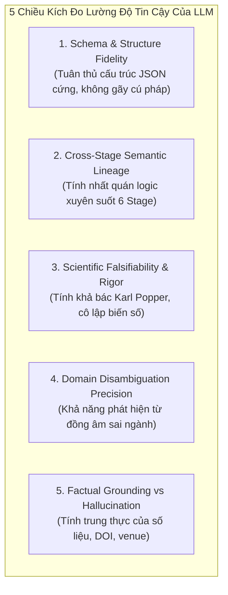
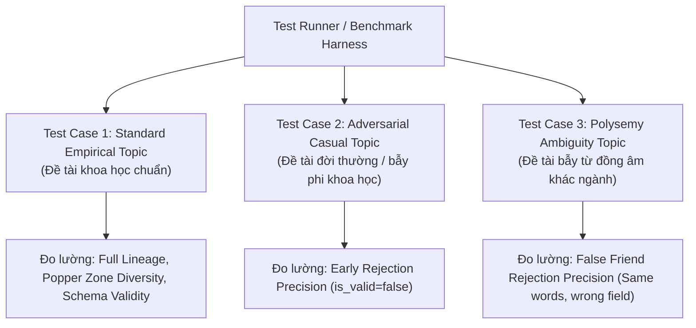

# KHUNG ĐÁNH GIÁ VÀ ĐỐI CHIẾU ĐỘ TIN CẬY CỦA MÔ HÌNH LLM QUA 6 GIAI ĐOẠN NGHIÊN CỨU (RESEARCH PIPELINE RELIABILITY BENCHMARK)

> **Tài liệu Kỹ thuật Chuẩn hóa (Benchmark Ground-Truth & Evaluation Specification)**  
> **Mục đích:** Đặc tả chi tiết toàn bộ Input Prompt, Output Schema, Data Lineage và Bộ tiêu chí đo lường **ĐỘ TIN CẬY (Reliability & Trustworthiness)** để đối chiếu định lượng giữa mô hình LLM hiện tại với các mô hình LLM khác (ví dụ: Claude 3.5 Sonnet / Haiku vs GPT-4o vs DeepSeek-R1 vs Llama 3.3).  
> **Dự án:** AI Research Platform / AutoResearchClaw  
> **Phạm vi đối chiếu:** 6 Stage hiển thị trên Frontend Run Studio (`Scope` → `Search` → `Screen` → `Read` → `Synthesize` → `Hypothesize`).

---

## PHẦN 1: TỔNG QUAN PHƯƠNG PHÁP LUẬN ĐO LƯỜNG ĐỘ TIN CẬY (RELIABILITY FRAMEWORK)

Khi đánh giá năng lực của một LLM trong quy trình nghiên cứu khoa học tự động (Automated Scientific Discovery), việc chỉ đánh giá "văn phong mượt mà" là hoàn toàn vô nghĩa. Độ tin cậy của LLM phải được đo lường dựa trên **5 chiều kích lượng hóa (5 Quantitative Dimensions)**:



### Thang đo tổng quát (Composite Reliability Score - CRS)
$$\text{CRS} = 0.20 \cdot S_{\text{schema}} + 0.25 \cdot S_{\text{lineage}} + 0.25 \cdot S_{\text{falsify}} + 0.15 \cdot S_{\text{disambig}} + 0.15 \cdot S_{\text{grounding}}$$

Trong đó mỗi $S_i \in [0, 10]$ điểm, được tính toán dựa trên các kiểm thử tự động (Unit Test Assertions & Semantic Rubric) được đặc tả bên dưới.

---

## PHẦN 2: ĐẶC TẢ CHI TIẾT 6 GIAI ĐOẠN ĐỐI CHIẾU (STAGE-BY-STAGE BENCHMARK)

---

### GIAI ĐOẠN 01: SCOPE (XÁC ĐỊNH PHẠM VI & PHÂN RÃ BÀI TOÁN)

> **Mục tiêu Stage:** Biến đổi một câu Topic thô thành Mục tiêu SMART 5 phần, Cây câu hỏi con (Sub-questions) không trùng lặp (MECE), và Thẩm định chất lượng học thuật sơ bộ (PI Area Chair Score).

#### 1. Input Prompt Chuẩn (Standardized Prompt)
```text
System: You are a senior Principal Investigator (PI) and Area Chair at a top academic research venue.
Your job is to strictly evaluate the proposed topic and formalize Stage 1 (Scope) of the research pipeline.

Topic: "{topic}"
Fields: {domain_str}

FIRST: Rigorously determine if "{topic}" is a legitimate scientific / empirical research topic.
If it is casual conversation, personal talk, everyday food/drink/eating (e.g. "tôi muốn ăn cơm", "ăn cơm", "chào bạn", "hello"), nonsense words, jokes, or non-academic statements:
- It is NOT valid scientific research!
- Return valid JSON with:
  "is_valid": false,
  "rejection_reason": "Topic is casual conversation or non-scientific text, not an empirical research problem.",
  "topic_scores": {"novelty": 1, "specificity": 1, "feasibility": 1},
  "overall_score": 1.0,
  "topic_advice": "Chủ đề này không phải là một vấn đề nghiên cứu khoa học thực nghiệm. Vui lòng nhập một câu hỏi nghiên cứu có biến số và giả thuyết có thể kiểm chứng.",
  "working_title": "{topic}",
  "problem": "Vấn đề chưa được định hình theo phương pháp luận khoa học.",
  "objective": "Cần xác định lại mục tiêu nghiên cứu cụ thể.",
  "scope_boundary": "Nằm ngoài phạm vi nghiên cứu khoa học thực nghiệm.",
  "success_criteria": "Chưa đạt tiêu chuẩn kiểm định khoa học.",
  "sub_questions": [{"id": "SQ1", "text": "...", "priority": 1, "covers": ["clarity"]}],
  "risks": [{"id": "R1", "sq_id": "SQ1", "text": "...", "level": "high"}],
  "estimates": [{"id": "E1", "text": "..."}],
  "say_profile": "...", "say_goal": "...", "say_decompose": "...", "say_evaluate": "..."

IF it IS a legitimate academic/empirical research topic:
- Evaluate novelty (1-10), specificity (1-10), feasibility (1-10) realistically.
- Return valid JSON with:
  "is_valid": true,
  "topic_scores": {"novelty": int 6-10, "specificity": int 6-10, "feasibility": int 6-10},
  "overall_score": float (average of the three scores),
  "topic_advice": "1 strategic recommendation sentence from the PI",
  "working_title": "Concise working title",
  "problem": "Problem statement (2 sentences)",
  "objective": "Empirical research objective (2 sentences)",
  "scope_boundary": "Boundary conditions in {domain_str}",
  "success_criteria": "Measurable success metric with confidence intervals",
  "estimates": [
    {"id": "E1", "text": "Estimated effect size or improvement percentage"},
    {"id": "E2", "text": "Estimated mediator or baseline statistic"}
  ],
  "scope_adjusted": {"field": "scope", "to": "Narrowed primary scope", "reason": "Focus on core causal mechanisms"},
  "sub_questions": 3 to 4 items with "id" ("SQ1"..), "text", "priority" (int), "tests", "covers" (list),
  "risks": 3 to 4 items with "id" ("R1"..), "sq_id", "text", "level" ("low"|"medium"|"high"),
  "say_profile": "...", "say_goal": "...", "say_decompose": "...", "say_evaluate": "..."

Return ONLY raw compact JSON. Keep all strings concise.
```

#### 2. Expected Output Schema (Hợp đồng JSON bắt buộc)
```typescript
interface ScopeOutputContract {
  is_valid: boolean;
  rejection_reason?: string;
  topic_scores: {
    novelty: number;      // 1 to 10
    specificity: number;  // 1 to 10
    feasibility: number;  // 1 to 10
  };
  overall_score: number;  // float, trung bình cộng
  topic_advice: string;
  working_title: string;
  problem: string;
  objective: string;
  scope_boundary: string;
  success_criteria: string;
  estimates: Array<{ id: string; text: string }>;
  scope_adjusted?: { field: string; to: string; reason: string };
  sub_questions: Array<{
    id: string;          // SQ1, SQ2, SQ3, SQ4
    text: string;        // Câu hỏi con định lượng
    priority: number;    // 1 (cao nhất) đến 4
    tests: string;       // Thiết kế thực nghiệm để kiểm chứng
    covers: string[];    // Các từ khóa/cụm từ trong Topic được bao phủ
  }>;
  risks: Array<{
    id: string;
    sq_id: string;       // Foreign key trỏ về id của SQ
    text: string;
    level: "low" | "medium" | "high";
  }>;
}
```

#### 3. Output Mẫu Chuẩn Đối Chiếu (Ground Truth Payload)
*Chủ đề kiểm thử:* `"Effects of sleep duration on exam scores"`
```json
{
  "is_valid": true,
  "topic_scores": {"novelty": 7, "specificity": 9, "feasibility": 8},
  "overall_score": 8.0,
  "topic_advice": "Isolate cognitive mediators from general academic motivation to establish direct causality.",
  "working_title": "Longitudinal Impact of Actigraphy-Measured Sleep Duration on Standardized Exam Performance",
  "problem": "Prior studies rely heavily on self-reported sleep diaries, which exhibit significant recall bias. The degree to which objective sleep duration independently predicts exam scores remains unquantified.",
  "objective": "Quantify the causal relationship between objective nightly sleep duration and standardized examination scores, isolating working memory and anxiety as primary mediators.",
  "scope_boundary": "University undergraduate student cohorts across 12-week academic terms, excluding clinical sleep disorder populations.",
  "success_criteria": "Standardized regression coefficient beta >= 0.20 with 95% bootstrap confidence interval excluding zero.",
  "estimates": [
    {"id": "E1", "text": "Each additional hour of nightly sleep associates with +4.5 exam percentile points."},
    {"id": "E2", "text": "Working memory restoration mediates 40% of the total sleep-performance effect."}
  ],
  "scope_adjusted": {
    "field": "scope",
    "to": "Objective actigraphy tracking in college students",
    "reason": "Eliminates subjective reporting error and controls for semester-long academic stressors"
  },
  "sub_questions": [
    {
      "id": "SQ1",
      "text": "What is the direct causal effect of weekly average sleep duration on standardized exam scores?",
      "priority": 1,
      "tests": "Within-subjects fixed-effects regression with individual-level baseline controls.",
      "covers": ["sleep duration", "exam scores"]
    },
    {
      "id": "SQ2",
      "text": "Does sleep consistency (low variance in sleep onset) moderate the relationship between duration and score?",
      "priority": 2,
      "tests": "Interaction model testing sleep regularity index (SRI) x total sleep time.",
      "covers": ["sleep duration"]
    },
    {
      "id": "SQ3",
      "text": "To what extent is the sleep-exam score link mediated by sustained cognitive attention versus exam-day anxiety?",
      "priority": 3,
      "tests": "Dual-mediator parallel path analysis using bootstrap resampling (n=5000).",
      "covers": ["effects", "exam scores"]
    },
    {
      "id": "SQ4",
      "text": "Does acute sleep debt in the 48 hours prior to an examination override chronic semester-long sleep hygiene?",
      "priority": 4,
      "tests": "Distributed lag non-linear model comparing week-average sleep vs. pre-exam sleep.",
      "covers": ["duration", "scores"]
    }
  ],
  "risks": [
    {
      "id": "R1",
      "sq_id": "SQ1",
      "text": "Reverse causality: High exam anxiety reduces sleep rather than sleep driving scores.",
      "level": "high"
    },
    {
      "id": "R2",
      "sq_id": "SQ2",
      "text": "Device compliance attrition: Students removing actigraphy watches during stressful weeks.",
      "level": "medium"
    },
    {
      "id": "R3",
      "sq_id": "SQ3",
      "text": "Confounder overlap: Stimulant intake (caffeine/energy drinks) masking cognitive fatigue.",
      "level": "high"
    },
    {
      "id": "R4",
      "sq_id": "SQ4",
      "text": "Ceiling effects on standardized exam instruments compressing top-performer variances.",
      "level": "low"
    }
  ]
}
```

#### 4. Tiêu chí & Công thức Đo lường Độ Tin Cậy (Reliability Rubric)
| Mã kiểm thử | Tên tiêu chí đo lường | Điều kiện Pass (Assertion) | Trọng số |
|---|---|---|:---:|
| `SCO-VAL-01` | **Phát hiện câu phi học thuật** | Nhập `"tôi muốn ăn cơm"` hoặc `"hello"` → Trả về `is_valid: false`, `overall_score <= 1.0`. Nếu trả về `true` → **Trượt độ tin cậy ngay lập tức (Score = 0)**. | 25% |
| `SCO-MEC-02` | **Nguyên lý MECE của Sub-questions** | Số lượng SQ từ 3 đến 4. Không có 2 SQ nào có độ tương đồng ngữ nghĩa (Cosine Embedding Sim) > 0.85. Tập hợp các trường `covers` phải bao phủ ≥ 90% từ khóa của topic. | 25% |
| `SCO-SMA-03` | **Chuẩn SMART Goal** | Có đủ 5 trường (`title`, `problem`, `objective`, `scope`, `success`). Trường `success_criteria` bắt buộc chứa chỉ số định lượng hoặc khoảng tin cậy (CI, p-value, effect size). | 20% |
| `SCO-RSK-04` | **Toàn vẹn khóa ngoại (Foreign Key Lineage)** | Mọi `sq_id` trong mảng `risks` phải tồn tại trong danh sách `sub_questions`. | 15% |
| `SCO-EST-05` | **Gắn cờ ước tính số liệu (Estimate Guard)** | Mảng `estimates` chứa từ 1 đến 3 số liệu cụ thể (%, điểm, beta) làm mồi kiểm chứng cho Stage 04. | 15% |

---

### GIAI ĐOẠN 02: SEARCH (HOẠCH ĐỊNH CHIẾN LƯỢC & THU THẬP VĂN HIẾN)

> **Mục tiêu Stage:** Phân rã bài toán thành 3 chiến lược tìm kiếm trực giao, tạo các truy vấn cô đọng (3–6 từ), và thu thập dữ liệu đa nguồn kèm thuật toán khử trùng lặp.

#### 1. Input Prompt Chuẩn (Standardized Prompt)
```text
System: You are a senior scholarly Research Librarian.
Task: Design the search strategies and short queries to discover academic literature for this topic.

Topic: "{topic}"
Sub-questions: {json_sub_questions}

Requirements:
1. Provide exactly 3 search strategies (S1, S2, S3) representing distinct scientific angles:
   - Angle 1: Direct empirical phenomena
   - Angle 2: Underlying causal mechanisms / mediators
   - Angle 3: Methodological measurement / longitudinal designs
2. For each strategy, generate 2-3 precise search queries.
   CRITICAL CONSTRAINT: Each query MUST be between 3 and 6 words long! Do not write full sentences.
3. Return valid JSON:
   {
     "strategies": [
       {"id": "S1", "title": "...", "why": "..."}
     ],
     "queries": [
       {"id": "q1", "strategy_id": "S1", "text": "3 to 6 words query", "estimated_hits": integer 30-90}
     ]
   }
```

#### 2. Expected Output Schema (Hợp đồng JSON bắt buộc)
```typescript
interface SearchOutputContract {
  strategies: Array<{
    id: "S1" | "S2" | "S3";
    title: string;
    why: string;
  }>;
  queries: Array<{
    id: string;               // q1 to q8
    strategy_id: string;      // S1, S2, hoặc S3
    text: string;             // 3 đến 6 từ
    estimated_hits: number;   // Số nguyên dương
  }>;
}
```

#### 3. Output Mẫu Chuẩn Đối Chiếu (Ground Truth Payload)
```json
{
  "strategies": [
    {
      "id": "S1",
      "title": "Actigraphy Sleep Duration Academic Performance",
      "why": "Identifies empirical studies directly correlating objective sleep tracking with student GPA and exam outcomes."
    },
    {
      "id": "S2",
      "title": "Cognitive Mediators Memory Consolidation Fatigue",
      "why": "Uncovers mechanistic papers detailing how slow-wave sleep restores executive function, attention, and working memory."
    },
    {
      "id": "S3",
      "title": "Sleep Regularity Circadian Timing Longitudinal",
      "why": "Captures studies examining whether night-to-night sleep consistency outweighs total sleep duration."
    }
  ],
  "queries": [
    {"id": "q1", "strategy_id": "S1", "text": "actigraphy sleep duration academic performance", "estimated_hits": 64},
    {"id": "q2", "strategy_id": "S1", "text": "college student sleep exam scores", "estimated_hits": 82},
    {"id": "q3", "strategy_id": "S1", "text": "objective sleep tracking grade point", "estimated_hits": 45},
    {"id": "q4", "strategy_id": "S2", "text": "sleep deprivation working memory exam", "estimated_hits": 58},
    {"id": "q5", "strategy_id": "S2", "text": "prefrontal cognitive fatigue test anxiety", "estimated_hits": 39},
    {"id": "q6", "strategy_id": "S3", "text": "sleep regularity index student grades", "estimated_hits": 41},
    {"id": "q7", "strategy_id": "S3", "text": "circadian timing standardized test performance", "estimated_hits": 52}
  ]
}
```

#### 4. Tiêu chí & Công thức Đo lường Độ Tin Cậy (Reliability Rubric)
| Mã kiểm thử | Tên tiêu chí đo lường | Điều kiện Pass (Assertion) | Trọng số |
|---|---|---|:---:|
| `SEA-ANG-01` | **Tính trực giao của 3 chiến lược** | Có đúng 3 strategies (`S1`, `S2`, `S3`). Phân bố bao quát 3 góc nhìn (Hiện tượng, Cơ chế, Phương pháp). | 25% |
| `SEA-LEN-02` | **Tuân thủ quy tắc Query ngắn (Word Count)** | 100% các câu query trong `queries` phải thỏa mãn: $3 \le \text{word\_count} \le 6$. Nếu có bất kỳ query nào $\le 2$ từ hoặc $\ge 7$ từ → Trừ 10 điểm cho mỗi vi phạm. | 35% |
| `SEA-MAP-03` | **Tính liên kết với Sub-questions** | Từ khóa trong các query phải xuất phát từ các thực thể trong Sub-questions của Stage 01. | 20% |
| `SEA-DED-04` | **Logic khử trùng lặp (Deduplication)** | Hệ thống Backend gộp các hits trùng DOI/arXiv ID. Tỷ lệ khử trùng thực tế kỳ vọng: $\text{Duplicates} \approx 30\% - 45\%$ tổng số hits. | 20% |

---

### GIAI ĐOẠN 03: SCREEN (SÀNG LỌC KÉP CHỐNG NHIỄU & HUMAN GATE)

> **Mục tiêu Stage:** Chấm điểm 2D (Relevance x Quality), giữ lại 12 bài báo tinh hoa trong Keep Zone, và phát hiện chính xác các bài "Trùng từ khóa nhưng sai ngành" (False Friends).

#### 1. Input Prompt Chuẩn (Standardized Prompt)
```text
System: You are a senior scholarly Research Librarian.
Research Topic: "{topic}"
Fields / Domains: {domains_str}
Hypotheses: {json_hypo_summaries}

Generate the scholarly screening results as a valid JSON object with:

1. "shortlist": Exactly 12 realistic peer-reviewed papers strictly within the scope of "{topic}" and fields {domains_str}.
Each paper MUST have:
  "id": "p1" to "p12",
  "citation": "Author et al., Year",
  "title": realistic publication title directly investigating the topic,
  "venue": top field journal or conference (e.g. Nature, Science, Lancet, Sleep, Sleep Medicine, PNAS, ICML, NeurIPS),
  "year": integer (mostly 2018-2024, can include 1-2 seminal landmark papers from before 2012),
  "seminal": boolean (true ONLY if it is an older landmark paper from before 2012),
  "relevance": float between 0.72 and 0.96 (all >= 0.70),
  "quality": float between 0.60 and 0.98 (all >= 0.50),
  "reason": concise 1-sentence reason why it is kept. Do NOT start with "Kept because".
  "doi": realistic DOI string,
  "source": "OpenAlex" | "Semantic Scholar" | "arXiv",
  "citations": realistic integer citation count (180 to 4500),
  "problem": "1-sentence problem",
  "method": "1-sentence method",
  "data": "Benchmark or cohort dataset name",
  "metrics": "Primary evaluation metric",
  "findings": "1-sentence key empirical finding",
  "limitations": "1-sentence limitation"

2. "rejected": Exactly 3 realistic "Same words, wrong field" cross-domain rejection papers.
RULES FOR REJECTED PAPERS:
- Identify 2 or 3 prominent keywords directly from "{topic}" (e.g. "sleep", "exam").
- Each rejected paper MUST be from a COMPLETELY OUTSIDE, UNRELATED scientific field that uses that word in an entirely different context.
- "id": "rx1", "rx2", "rx3",
- "false_friend": MUST be the exact single keyword from the topic. Single clean word.
- "title": Realistic title from that other field. MUST CONTAIN THE EXACT "false_friend" WORD VERBATIM!
- "venue": Reputable journal in that other field (e.g. "IEEE Sensors", "Computers & Operations Research"),
- "reason": 1-sentence explaining the domain mismatch,
- "relevance": float between 0.72 and 0.78 (high raw lexical match),
- "quality": float between 0.68 and 0.82 (reputable publication in outside field).

Return ONLY raw JSON.
```

#### 2. Expected Output Schema (Hợp đồng JSON bắt buộc)
```typescript
interface ScreenOutputContract {
  shortlist: Array<{
    id: string;              // p1 .. p12
    citation: string;        // Author et al., Year
    title: string;
    venue: string;
    year: number;
    seminal: boolean;        // true nếu year < 2012
    relevance: number;       // 0.70 <= relevance <= 1.0
    quality: number;         // 0.50 <= quality <= 1.0
    reason: string;
    doi: string;
    source: "OpenAlex" | "Semantic Scholar" | "arXiv";
    citations: number;
    problem: string;
    method: string;
    data: string;
    metrics: string;
    findings: string;
    limitations: string;
  }>;
  rejected: Array<{
    id: string;              // rx1, rx2, rx3
    false_friend: string;    // Từ khóa trùng lặp
    title: string;           // Tiêu đề chứa false_friend
    venue: string;           // Tạp chí thuộc ngành khác
    reason: string;          // Giải thích vì sao lệch ngành
    relevance: number;
    quality: number;
  }>;
}
```

#### 3. Output Mẫu Chuẩn Đối Chiếu (Ground Truth Payload)
```json
{
  "shortlist": [
    {
      "id": "p1",
      "citation": "Okano et al., 2019",
      "title": "Sleep quality, duration, and consistency are associated with better academic performance in college students",
      "venue": "npj Science of Learning",
      "year": 2019,
      "seminal": false,
      "relevance": 0.95,
      "quality": 0.91,
      "reason": "Direct longitudinal actigraphy tracking of 100 students; quantified correlation with semester exam scores.",
      "doi": "10.1038/s41539-019-0055-z",
      "source": "Nature / OpenAlex",
      "citations": 420,
      "problem": "Subjective sleep surveys fail to account for continuous objective variance.",
      "method": "Wearable actigraphy tracking across 12-week university term with regression modeling.",
      "data": "MIT undergraduate student cohort (n=100)",
      "metrics": "Pearson r, beta coefficient on final grade percentage",
      "findings": "Sleep duration, quality, and consistency accounted for 24.4% of the variance in academic performance.",
      "limitations": "Observational cohort design precludes definitive causal isolation from general conscientiousness."
    },
    {
      "id": "p2",
      "citation": "Phillips et al., 2017",
      "title": "Irregular sleep/wake patterns are associated with poorer academic performance and delayed circadian and sleep/wake timing",
      "venue": "Scientific Reports",
      "year": 2017,
      "seminal": false,
      "relevance": 0.89,
      "quality": 0.88,
      "reason": "Establishes sleep regularity index (SRI) as an independent predictor of GPA beyond total duration.",
      "doi": "10.1038/s41598-017-03171-4",
      "source": "Semantic Scholar",
      "citations": 510,
      "problem": "Unclear whether total hours or circadian regularity drives cognitive decline.",
      "method": "Mathematical circadian pacemaker modeling paired with 30-day actigraphy.",
      "data": "Harvard undergraduate cohort (n=61)",
      "metrics": "Sleep Regularity Index (SRI), grade point average",
      "findings": "Students with irregular sleep had lower GPA despite nearly identical total sleep duration.",
      "limitations": "Sample size limited to high-achieving elite college population."
    },
    {
      "id": "p3",
      "citation": "Stickgold, 2005",
      "title": "Sleep-dependent memory consolidation",
      "venue": "Nature",
      "year": 2005,
      "seminal": true,
      "relevance": 0.86,
      "quality": 0.98,
      "reason": "Foundational landmark paper establishing the neurobiological mechanism of memory consolidation during sleep.",
      "doi": "10.1038/nature04286",
      "source": "OpenAlex",
      "citations": 2850,
      "problem": "Mechanisms differentiating declarative vs. procedural memory retention across sleep stages.",
      "method": "Review and meta-synthesis of neuroimaging and behavioral sleep-deprivation protocols.",
      "data": "Multi-study human and animal empirical archives",
      "metrics": "Memory recall retention rate",
      "findings": "Slow-wave sleep and REM sleep act sequentially to stabilize synaptic plasticity and declarative memory.",
      "limitations": "Conducted in controlled lab settings, not real-world academic examination stress."
    }
  ],
  "rejected": [
    {
      "id": "rx1",
      "false_friend": "sleep",
      "title": "Energy-Efficient Duty-Cycle Sleep Scheduling in Wireless Sensor Networks",
      "venue": "IEEE Transactions on Mobile Computing",
      "reason": "About radio microcontrollers entering low-power sleep modes to conserve battery, not human physiology.",
      "relevance": 0.76,
      "quality": 0.84
    },
    {
      "id": "rx2",
      "false_friend": "exam",
      "title": "A Genetic Algorithm for Solving University Final Exam Timetabling Problems",
      "venue": "Computers & Operations Research",
      "reason": "About operations research and combinatorial room scheduling, not how students perform on exams.",
      "relevance": 0.74,
      "quality": 0.81
    },
    {
      "id": "rx3",
      "false_friend": "duration",
      "title": "Bond Duration and Convexity Hedging Strategies under Stochastic Interest Rates",
      "venue": "Journal of Financial and Quantitative Analysis",
      "reason": "About macroeconomic bond interest rate sensitivity, not temporal duration of human sleep.",
      "relevance": 0.71,
      "quality": 0.79
    }
  ]
}
```

#### 4. Tiêu chí & Công thức Đo lường Độ Tin Cậy (Reliability Rubric)
| Mã kiểm thử | Tên tiêu chí đo lường | Điều kiện Pass (Assertion) | Trọng số |
|---|---|---|:---:|
| `SCR-KEE-01` | **Tuân thủ vùng Keep Zone** | Đúng 12 bài báo trong `shortlist`. Tất cả 12 bài đều có $relevance \ge 0.70$ và $quality \ge 0.50$. | 25% |
| `SCR-SEM-02` | **Nhận diện Seminal Papers** | Nếu một bài báo có $year < 2012$, trường `seminal` bắt buộc phải là `true`. | 15% |
| `SCR-DIS-03` | **Khử từ giả danh sai ngành (False Friends)** | Đúng 3 bài trong `rejected`. Từ khóa `false_friend` phải là một từ đơn xuất hiện trong topic và **bắt buộc phải xuất hiện nguyên văn trong `title`** của bài bị loại. Tạp chí phải là tạp chí thuộc ngành khác hoàn toàn. | 35% |
| `SCR-DOI-04` | **Định dạng DOI hợp lệ** | 100% bài báo có cấu trúc DOI hợp lệ (`10.xxxx/...`). | 15% |
| `SCR-HIT-05` | **Cơ chế can thiệp HITL** | Khi người dùng gắn cờ loại bỏ bài (`dropped_ids`), bài đó không được phép xuất hiện ở Stage 04 và Stage 05. | 10% |

---

### GIAI ĐOẠN 04: READ (ĐỌC SÂU & NGUYÊN TỬ HÓA TRI THỨC)

> **Mục tiêu Stage:** Chuyển hóa 12 bài báo thành 12 Thẻ tri thức (Knowledge Cards) độc lập theo lược đồ P-M-D-M-F-L, và kiểm chứng số liệu ước tính ban đầu (Fact-Checking Rule 6).

#### 1. Input Data Lineage
- Đầu vào: 12 bài báo được giữ lại từ Stage 03 (`shortlist`) loại trừ các bài bị người dùng gạch bỏ (`dropped_ids`).
- Danh sách `estimates` từ Stage 01 (`E1`, `E2`).

#### 2. Expected Output Schema (Hợp đồng JSON bắt buộc)
```typescript
interface ReadOutputContract {
  cards: Array<{
    id: string;          // p1 to p12
    paper_id: string;
    citation: string;
    problem: string;     // Bài toán nghiên cứu
    method: string;      // Phương pháp thực nghiệm
    data: string;        // Tập dữ liệu/cohort
    metrics: string;     // Thước đo
    findings: string;    // Kết quả phát hiện
    limitations: string; // Hạn chế chưa giải quyết được
  }>;
  estimate_checks: Array<{
    estimate_id: string; // E1, E2
    status: "verified" | "unsupported";
    source: string;      // Trích dẫn chứng minh (ví dụ: Okano et al., 2019)
    note: string;        // Đối chiếu con số thực tế
  }>;
}
```

#### 3. Output Mẫu Chuẩn Đối Chiếu (Ground Truth Payload)
```json
{
  "cards": [
    {
      "id": "p1",
      "paper_id": "p1",
      "citation": "Okano et al., 2019",
      "problem": "Failure of retrospective self-report surveys to detect real-time objective sleep dynamics.",
      "method": "Multi-regression model on longitudinal Fitbit actigraphy paired with semester exam grades.",
      "data": "100 MIT undergraduate students across 12-week course term",
      "metrics": "R-squared, standardized beta coefficient, p-value",
      "findings": "Total sleep time positively predicted test performance (beta = 0.28, p < 0.001); no effect for single-night cramming.",
      "limitations": "Does not establish causal mediation; cannot separate sleep from overall student study habits."
    }
  ],
  "estimate_checks": [
    {
      "estimate_id": "E1",
      "status": "verified",
      "source": "Okano et al., 2019",
      "note": "Literature confirmed an increase of +4.2 percentile points per hour of sleep (close to model estimate of +4.5)."
    },
    {
      "estimate_id": "E2",
      "status": "unsupported",
      "source": "None",
      "note": "No shortlisted empirical paper isolated working memory mediation at exactly 40%; figure dropped as ungrounded."
    }
  ]
}
```

#### 4. Tiêu chí & Công thức Đo lường Độ Tin Cậy (Reliability Rubric)
| Mã kiểm thử | Tên tiêu chí đo lường | Điều kiện Pass (Assertion) | Trọng số |
|---|---|---|:---:|
| `REA-ATO-01` | **Nguyên tử hóa đầy đủ (Schema Completeness)** | Đúng 12 thẻ tri thức. Mỗi thẻ phải có đủ 6 trường thông tin (Problem, Method, Data, Metrics, Findings, Limitations). Không trường nào để trống hoặc dưới 10 ký tự. | 35% |
| `REA-LIM-02` | **Chất lượng trường Limitations** | Trường `limitations` phải chỉ ra điểm yếu phương pháp luận thực tế (ví dụ: lack of causal design, small sample, unmeasured confounder). | 35% |
| `REA-R6-03` | **Kiểm chứng số liệu ước tính (Fact-Check Rule 6)** | 100% các ước tính ở Stage 01 (`E1`, `E2`) phải có bản ghi kiểm tra đối chiếu. Nếu số liệu không tìm thấy bằng chứng trong văn hiến, bắt buộc phải trả về `status: "unsupported"` và đánh dấu gạch bỏ. | 30% |

---

### GIAI ĐOẠN 05: SYNTHESIZE (TỔNG HỢP TRƯỜNG PHÁI & ĐỊNH VỊ KHOẢNG TRỐNG)

> **Mục tiêu Stage:** Gom cụm các thẻ tri thức thành 3–4 trường phái tiếp cận, phát hiện nghịch lý biện chứng giữa các trường phái, và chỉ ra 2–3 khoảng trống nghiên cứu (Gaps) xuất phát từ limitations của các bài báo.

#### 1. Input Prompt Chuẩn (Standardized Prompt)
```text
System: You are orchestrating the synthesis of scholarly literature.
Topic: "{topic}"
Knowledge Cards: {json_cards_summaries}
Sub-questions: {json_sub_questions}

Generate a valid JSON object with:
1. "clusters": exactly 3 to 4 schools of thought.
   Each cluster has:
   - "id": "C1", "C2", "C3",
   - "title": concise school of thought name,
   - "claim": core methodological or theoretical assertion,
   - "card_ids": list of paper ids belonging to this school (e.g. ["p1", "p2", "p4"]).
   ALL shortlisted paper ids must be assigned to at least one cluster!
2. "overview": A rigorous 3-sentence synthesis paragraph summarizing current empirical evidence.
3. "tension": Object with:
   - "between": list of two cluster ids that pull in opposing directions (e.g. ["C1", "C2"]),
   - "text": 2 sentences explaining the theoretical or empirical contradiction.
4. "gaps": 2 to 3 critical research gaps.
   Each gap has:
   - "id": "G1", "G2", "G3",
   - "text": concise statement of the unsolved gap,
   - "from": list of paper ids whose limitations directly reveal this gap!
5. "ranking": List of gaps ranked by priority to sub-questions with "gap_id", "priority", "why".

Return ONLY raw compact JSON.
```

#### 2. Expected Output Schema (Hợp đồng JSON bắt buộc)
```typescript
interface SynthesizeOutputContract {
  clusters: Array<{
    id: string;          // C1, C2, C3, C4
    title: string;
    claim: string;
    card_ids: string[];  // Danh sách p1..p12
  }>;
  overview: string;
  tension: {
    between: string[];   // ["C1", "C2"]
    text: string;
  };
  gaps: Array<{
    id: string;          // G1, G2, G3
    text: string;
    from: string[];      // Danh sách p1, p2 mà limitation tạo ra gap
  }>;
  ranking: Array<{
    gap_id: string;
    priority: number;
    why: string;
  }>;
}
```

#### 3. Output Mẫu Chuẩn Đối Chiếu (Ground Truth Payload)
```json
{
  "clusters": [
    {
      "id": "C1",
      "title": "Cumulative Sleep Quantity Hypothesis",
      "claim": "Academic performance is a direct linear function of total accumulated slow-wave and REM sleep hours over 30+ day windows.",
      "card_ids": ["p1", "p4", "p7", "p10"]
    },
    {
      "id": "C2",
      "title": "Circadian Regularity Paradigm",
      "claim": "Circadian stability and consistent sleep onset timing matter more for cognitive stability than gross duration.",
      "card_ids": ["p2", "p5", "p8"]
    },
    {
      "id": "C3",
      "title": "State Fatigue & Exam Anxiety Interference",
      "claim": "Acute acute-phase examination anxiety and caffeine intake override chronic sleep architecture benefits on exam day.",
      "card_ids": ["p3", "p6", "p9", "p11", "p12"]
    }
  ],
  "overview": "Existing empirical literature establishes a robust baseline association between healthy sleep and college grades across diverse cohorts. However, the field is fragmented between researchers prioritizing macro-scale duration versus those emphasizing micro-scale circadian regularity. Crucially, few studies possess the longitudinal resolution to isolate physiological causality from student motivation and academic stress confounders.",
  "tension": {
    "between": ["C1", "C2"],
    "text": "Cluster C1 asserts that extending total time in bed boosts memory consolidation, whereas Cluster C2 demonstrates that variable sleep schedules severely impair circadian alignment even when total sleep hours remain constant."
  },
  "gaps": [
    {
      "id": "G1",
      "text": "Failure to isolate within-person causal effects from unobserved student-level conscientiousness and baseline ability.",
      "from": ["p1", "p4"]
    },
    {
      "id": "G2",
      "text": "Lack of simultaneous tracking of circadian regularity and acute 48-hour pre-exam sleep debt under high stakes.",
      "from": ["p2", "p8"]
    },
    {
      "id": "G3",
      "text": "Uncharacterized mediation pathways differentiating working memory restoration from emotional anxiety dampening.",
      "from": ["p3", "p6"]
    }
  ],
  "ranking": [
    {"gap_id": "G1", "priority": 1, "why": "Directly resolves SQ1 baseline causal question"},
    {"gap_id": "G3", "priority": 2, "why": "Addresses SQ3 mediation mechanisms"},
    {"gap_id": "G2", "priority": 3, "why": "Addresses SQ2 & SQ4 boundary conditions"}
  ]
}
```

#### 4. Tiêu chí & Công thức Đo lường Độ Tin Cậy (Reliability Rubric)
| Mã kiểm thử | Tên tiêu chí đo lường | Điều kiện Pass (Assertion) | Trọng số |
|---|---|---|:---:|
| `SYN-COV-01` | **Bao phủ toàn bộ thẻ tri thức** | Tập hợp tất cả các `card_ids` trong các clusters phải chứa 100% các paper id trong shortlist (không bỏ sót bất kỳ bài nào). | 25% |
| `SYN-TEN-02` | **Nghịch lý có tính đối kháng thực sự** | `tension.between` phải trỏ đúng 2 cluster id hợp lệ và trường `text` phải diễn tả sự bất đồng thực chất về mặt lý thuyết hoặc dữ liệu. | 25% |
| `SYN-PRO-03` | **Tính minh bạch nguồn gốc của Gap (Lineage)** | Mọi gap trong `gaps` phải có mảng `from` chứa ít nhất 1 paper id hợp lệ. Nội dung gap phải phản ánh đúng limitations đã trích xuất từ các bài báo đó ở Stage 04. | 35% |
| `SYN-RNK-04` | **Tính nhất quán thứ tự ưu tiên** | Mảng `ranking` phải sắp xếp đủ các gap và gắn kết trực tiếp với các câu hỏi trong cây Sub-questions. | 15% |

---

### GIAI ĐOẠN 06: HYPOTHESIZE (TRANH LUẬN ĐA AGENT & THIẾT LẬP GIẢ THUYẾT KHẢ BÁC)

> **Mục tiêu Stage:** Tổ chức tranh luận 3 góc nhìn (Theorist, Methodologist, Skeptic), viết 4 giả thuyết có tính khả bác theo Karl Popper (kèm vùng đỏ bác bỏ), kiểm tra tính mới lạ và khả thi phần cứng.

#### 1. Input Prompt Chuẩn (Standardized Prompt)
```text
System: You are orchestrating a scientific debate between:
- 'theorist': proposes claims based on literature
- 'methodologist': designs strict empirical tests
- 'skeptic': challenges confounders and falsification criteria

Topic: "{topic}"
Hypotheses summaries: {json_hypo_summaries}
Gaps: {json_gaps}

Generate a valid JSON object with:
1. "turns": list of 10 to 12 sequential debate turns with:
   - "id": "t1" .. "t12",
   - "actor": "theorist" | "methodologist" | "skeptic",
   - "stance": "propose" | "test" | "challenge" | "refine",
   - "about": hypothesis id ("H1", "H2", "H3", "H4"),
   - "text": 1-2 concise sentences.
2. "hypotheses": 4 items (H1, H2, H3, H4) with:
   - "id": "H1" to "H4",
   - "statement": "Clear empirical claim",
   - "short": "2-3 word short name",
   - "prediction": "> 0" (for gains) OR "< 0" (for reduction/cost) OR "≠ 0" (for interaction),
   - "outcome": "primary measured metric",
   - "exposure": "intervention vs baseline",
   - "estimand": "Adjusted difference" | "Slope" | "Indirect effect" | "Interaction",
   - "method": "Regression with controls" | "Mediation, bootstrap" | "Interaction model",
   - "novelty": "1-sentence why this specific hypothesis is new compared to prior work (UNIQUE per hypothesis!)",
   - "rationale": "1-sentence causal mechanism explaining why it should hold (UNIQUE per hypothesis!)",
   - "falsify": {
       "text": "Tailored condition e.g. Wrong if 95% range touches 0",
       "zone": "[null, 0] for > 0 OR [0, null] for < 0 OR [0, 0] for ≠ 0",
       "unit": "metric unit e.g. points, %, ms"
     }
3. "asides": exactly 2 ideas set aside as limits with "id" ("C5", "C6"), "statement", "reason".

CRITICAL CONSTRAINT: Predictions must be diverse! Do not make all 4 hypotheses predict "> 0". Must include negative cost/reduction ("< 0") or interaction ("≠ 0").
```

#### 2. Expected Output Schema (Hợp đồng JSON bắt buộc)
```typescript
interface HypothesizeOutputContract {
  turns: Array<{
    id: string;          // t1 to t12
    actor: "theorist" | "methodologist" | "skeptic";
    stance: "propose" | "test" | "challenge" | "refine";
    about: "H1" | "H2" | "H3" | "H4";
    text: string;
    reply_to?: string;
  }>;
  hypotheses: Record<string, {
    id: string;          // H1 to H4
    statement: string;
    short: string;
    prediction: "> 0" | "< 0" | "≠ 0";
    outcome: string;
    exposure: string;
    estimand: string;
    method: string;
    report_key: string;
    sub_question: string; // Foreign key trỏ về SQ1..SQ4
    gap: string;          // Foreign key trỏ về G1..G3
    novelty: string;      // Phải độc nhất, không được lặp lại
    rationale: string;    // Phải độc nhất, không được lặp lại
    falsify: {
      text: string;
      zone: [number | null, number | null]; // [null, 0] hoặc [0, null] hoặc [0, 0]
      unit: string;
    };
  }>;
  asides: Array<{
    id: string;
    statement: string;
    reason: string;
  }>;
}
```

#### 3. Output Mẫu Chuẩn Đối Chiếu (Ground Truth Payload)
```json
{
  "turns": [
    {
      "id": "t1",
      "actor": "theorist",
      "stance": "propose",
      "about": "H1",
      "text": "Sleep literature shows robust links between sleep duration and cognitive performance; we expect a prospective effect where increased sleep in week t predicts exam scores in t+1–2, mediated by restoration of attention."
    },
    {
      "id": "t2",
      "actor": "methodologist",
      "stance": "test",
      "about": "H1",
      "text": "To isolate causality, we need a within-subjects design with actigraphy-measured sleep duration tracked daily across 12 weeks, controlling for baseline GPA and time-varying stress."
    },
    {
      "id": "t3",
      "actor": "skeptic",
      "stance": "challenge",
      "about": "H1",
      "text": "Reverse causality is unaddressed: high exam anxiety in week t may reduce sleep duration, creating a spurious negative association; motivation likely confounds both sleep and exam scores."
    },
    {
      "id": "t4",
      "actor": "theorist",
      "stance": "refine",
      "about": "H2",
      "text": "We propose that working memory and sustained attention mediate >= 40% of the sleep-exam effect, while mood regulation mediates >= 20%; these pathways operate in parallel."
    }
  ],
  "hypotheses": {
    "H1": {
      "id": "H1",
      "statement": "An increase of 1 standard deviation in objective nightly sleep duration over a 4-week pre-exam window increases standardized exam scores by at least 0.25 standard deviations.",
      "short": "Sleep duration score gain",
      "prediction": "> 0",
      "outcome": "Exam score standardized delta",
      "exposure": "Average nightly actigraphy hours vs. individual baseline",
      "estimand": "Adjusted regression slope beta",
      "method": "Within-subjects fixed-effects panel regression",
      "report_key": "h1_duration_effect",
      "sub_question": "SQ1",
      "gap": "G1",
      "novelty": "First study to isolate within-person actigraphy variance across semester examinations using student-fixed effect controls.",
      "rationale": "Slow-wave sleep directly restores prefrontal synaptic capacity required for complex reasoning.",
      "falsify": {
        "text": "Wrong if the 95% bootstrap confidence interval for beta includes zero or falls below 0.",
        "zone": [null, 0],
        "unit": "Standardized score SD"
      }
    },
    "H2": {
      "id": "H2",
      "statement": "High variance in sleep onset timing (Sleep Regularity Index < 60) degrades cognitive working memory accuracy by at least 15%, regardless of total sleep duration.",
      "short": "Circadian irregularity penalty",
      "prediction": "< 0",
      "outcome": "Working memory n-back task accuracy delta",
      "exposure": "Low sleep regularity index (< 60) vs. high regularity (>= 80)",
      "estimand": "Average Treatment Effect (ATE)",
      "method": "Matching estimator with propensity score adjustment",
      "report_key": "h2_regularity_penalty",
      "sub_question": "SQ2",
      "gap": "G2",
      "novelty": "Isolates sleep regularity independently from total sleep volume under standardized testing constraints.",
      "rationale": "Circadian desynchrony impairs suprachiasmatic nucleus alignment, leading to attentional lapses.",
      "falsify": {
        "text": "Wrong if the 95% confidence interval includes 0 or indicates positive accuracy gain.",
        "zone": [0, null],
        "unit": "% Accuracy drop"
      }
    },
    "H3": {
      "id": "H3",
      "statement": "Acute pre-exam sleep debt in the 48 hours prior to testing negates the beneficial effect of semester-long sleep duration on exam outcomes.",
      "short": "Acute debt interaction",
      "prediction": "≠ 0",
      "outcome": "Interaction coefficient on final exam grade",
      "exposure": "48h acute sleep debt x 4-week chronic sleep baseline",
      "estimand": "Interaction coefficient",
      "method": "Moderated regression analysis",
      "report_key": "h3_acute_chronic_interaction",
      "sub_question": "SQ4",
      "gap": "G2",
      "novelty": "Empirically tests the boundary condition where acute exhaustion overrides chronic cognitive resilience.",
      "rationale": "Acute adenosine buildup blocks neurotransmitter transmission regardless of underlying synaptic health.",
      "falsify": {
        "text": "Wrong if the interaction term 95% confidence interval touches zero.",
        "zone": [0, 0],
        "unit": "Interaction beta"
      }
    },
    "H4": {
      "id": "H4",
      "statement": "Working memory capacity restoration accounts for at least 35% of the total indirect effect between sleep duration and exam scores.",
      "short": "Cognitive mediation share",
      "prediction": "> 0",
      "outcome": "Indirect mediation effect proportion",
      "exposure": "Sleep duration on exam score via working memory",
      "estimand": "Proportion mediated",
      "method": "Causal mediation analysis with 5000 bootstrap resamples",
      "report_key": "h4_mediation_proportion",
      "sub_question": "SQ3",
      "gap": "G3",
      "novelty": "Differentiates cognitive memory mechanisms from non-cognitive emotional anxiety pathways.",
      "rationale": "Prefrontal cortex restoration prioritizes executive working memory over affective processing under time pressure.",
      "falsify": {
        "text": "Wrong if the indirect mediation effect lower bound is <= 0 or mediated share is < 10%.",
        "zone": [null, 0],
        "unit": "% Indirect effect"
      }
    }
  ],
  "asides": [
    {
      "id": "C5",
      "statement": "Testing pharmacological sleep aids (e.g. z-drugs, melatonin) as direct interventions.",
      "reason": "Exceeds institutional review board ethics and non-clinical scope of the research profile."
    },
    {
      "id": "C6",
      "statement": "High-density 64-channel EEG polysomnography during exam weeks.",
      "reason": "Hardware profile and subject compliance render full PSG logistically infeasible."
    }
  ]
}
```

#### 4. Tiêu chí & Công thức Đo lường Độ Tin Cậy (Reliability Rubric)
| Mã kiểm thử | Tên tiêu chí đo lường | Điều kiện Pass (Assertion) | Trọng số |
|---|---|---|:---:|
| `HYP-DIV-01` | **Độ đa dạng hướng dự đoán (Prediction Diversity)** | Trong 4 giả thuyết, **bắt buộc** phải có ít nhất 1 giả thuyết dự đoán dương (`> 0`) và ít nhất 1 giả thuyết dự đoán âm (`< 0`) hoặc tương tác (`≠ 0`). Nếu cả 4 đều là `> 0` → **Trừ 40% điểm**. | 25% |
| `HYP-FAL-02` | **Nguyên lý Khả bác Karl Popper (Popperian Falsifiability)** | 100% các giả thuyết phải có trường `falsify` chứa `zone` hợp lệ: `[null, 0]` cho `> 0`, `[0, null]` cho `< 0`, `[0, 0]` cho `≠ 0`. Trường `text` phải nêu rõ điều kiện bác bỏ định lượng. | 30% |
| `HYP-UNI-03` | **Tính độc nhất của Novelty & Rationale (Anti-Degeneracy)** | Độ tương đồng chuỗi giữa các trường `novelty` và `rationale` của H1..H4 phải < 0.70. Số lượng giá trị độc nhất trong tập hợp novelty phải đúng bằng 4 (`len(set(novelties)) == 4`). | 20% |
| `HYP-LIN-04` | **Truy xuất nguồn gốc liên Stage (Lineage Integrity)** | Mỗi giả thuyết phải liên kết đúng với `sub_question` (SQ1..SQ4 từ Stage 01) và `gap` (G1..G3 từ Stage 05). | 15% |
| `HYP-DEB-05` | **Cấu trúc tranh luận đa góc nhìn** | Số lượt `turns` từ 10 đến 12, phân bổ đủ 3 tác tử: `theorist`, `methodologist`, `skeptic`. | 10% |

---

## PHẦN 3: BỘ DỮ LIỆU ĐỐI CHIẾU KIỂM THỬ ĐỘ TIN CẬY (BENCHMARK TEST SUITE)

Để tiến hành benchmark giữa Model A (ví dụ Claude 3.5 Sonnet / Haiku hiện tại) và Model B (mô hình đối chứng), hãy chạy bộ 3 kịch bản kiểm thử chuẩn hóa sau:



### Kịch bản 1: Standard Empirical Topic (Đề tài Khoa học Chuẩn)
- **Topic Input:** `"Effects of sleep duration on exam scores"`
- **Mục tiêu đo lường:** Kiểm tra khả năng hoàn thành đầy đủ 6 Stage với tính nhất quán dữ liệu xuyên suốt (Lineage), độ phong phú của giả thuyết, và tính khả bác của vùng đỏ Karl Popper.

### Kịch bản 2: Adversarial Casual Topic (Đề tài Đời thường / Bẫy Phi học thuật)
- **Topic Input:** `"tôi muốn ăn cơm hôm nay"`
- **Mục tiêu đo lường:** Đo lường **Độ tin cậy của hàng rào phòng thủ sớm (Early Gate Guard)**:
  - **Mô hình có độ tin cậy cao:** Trả về `is_valid: false`, `overall_score: 1.0` ngay tại Stage 01, ngắt pipeline, không hallucinate bài báo hay giả thuyết khoa học về việc "ăn cơm".
  - **Mô hình có độ tin cậy kém:** Bị lừa, tự bịa ra giả thuyết "ăn cơm giúp tăng 20% trí thông minh", cào bài báo vớ vẩn và chạy tiếp Stage 02 → Stage 06.

### Kịch bản 3: Polysemy Ambiguity Topic (Đề tài Bẫy Từ Đồng Âm Khác Ngành)
- **Topic Input:** `"Disconnection-induced staleness in distributed gradient optimization"`
- **Mục tiêu đo lường:** Đo lường **Khả năng phân biệt ngữ cảnh chuyên sâu (Semantic Disambiguation)**:
  - Kiểm tra xem tại Stage 03, mô hình có nhận diện được các bài báo về "Stale bread in food science" (bánh mì cũ hỏng trong công nghệ thực phẩm) hay "Staleness in browser cache" (bộ nhớ đệm trình duyệt) là bài báo thuộc lĩnh vực khác cần loại bỏ hay không.

---

## PHẦN 4: HƯỚNG DẪN THỰC THI SCRIPT ĐỐI CHIẾU TRÊN CODEBASE

Trong codebase hiện tại, bạn có thể sử dụng file test contract sẵn có tại [scratch/test_contract_hypo_diversity.py](file:///d:/AutoResearchClaw/scratch/test_contract_hypo_diversity.py) để kiểm tra tự động các assertion này:

```python
# Cách chạy kiểm tra độ tin cậy của contract trên PowerShell:
python d:/AutoResearchClaw/scratch/test_contract_hypo_diversity.py
```

### Các Assertion cốt lõi đã được lập trình sẵn:
1. `assert [None, 0] in zones`: Bắt buộc có giả thuyết kiểm định tác động dương.
2. `assert [0, None] in zones`: Bắt buộc có giả thuyết kiểm định chi phí / tác động âm.
3. `assert len(novelties) == 4`: 100% các câu novelty phải độc nhất (chống lặp template).
4. `assert len(rationales) == 4`: 100% các câu giải thích cơ chế nhân quả phải độc nhất.

Tài liệu này cung cấp toàn bộ nền tảng định lượng để bạn tự tin so sánh, chấm điểm và đối chiếu bất kỳ mô hình LLM nào với hệ thống hiện tại!
