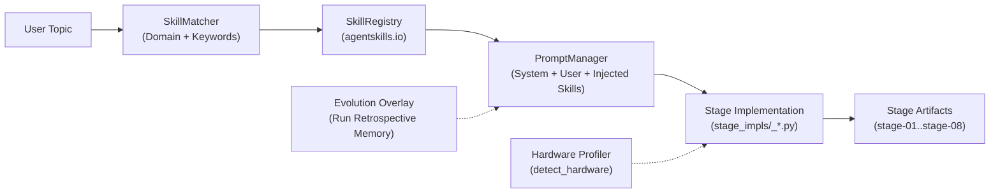

# HƯỚNG DẪN ĐẶC TẢ KIẾN TRÚC VÀ HỆ THỐNG SKILL: AUTORESEARCHCLAW (STAGE 1 → STAGE 8)
> **Tài liệu Kỹ thuật Chuyên sâu: Nguyên lý Học thuật, Hệ thống Skill & Cơ chế Vận hành Agent**  
> Dữ liệu đối chiếu thực nghiệm: `artifacts/rc-20261005-074706-96890a`  
> Chủ đề kiểm chứng: *Stale or Malicious? Disconnection-Induced Failures of History-Based Byzantine Defences in Asynchronous Federated Learning*

---

## PHẦN 1: TỔNG QUAN HỆ THỐNG SKILL & DOMAIN ADAPTER TRONG AUTORESEARCHCLAW

AutoResearchClaw không vận hành LLM như một chatbot thông thường. Hệ thống sử dụng kiến trúc **Modular Agentic Pipeline** kết hợp hệ thống **Skills chuẩn agentskills.io**, cơ chế **Domain Overlays**, và **Evolution Memory**.

### 1. Phân loại 4 nhóm Skill trong toàn bộ dự án (`VALID_CATEGORIES`)
Hệ sinh thái Skill được định nghĩa trong `researchclaw/skills/schema.py`:
1. **Domain Skills (`domain/`):** Cung cấp kiến thức chuyên gia theo ngành hẹp (Machine Learning, NLP Alignment, Computer Vision, Quantum Computing, Biology, HEP). Chứa các best-practices, danh sách benchmark chuẩn và các lỗi phổ biến cần tránh.
2. **Experiment Skills (`experiment/`):** Hướng dẫn thiết kế biến thực nghiệm, phân bổ seed, quy chuẩn kiểm định thống kê (p-value, t-test, ablation study).
3. **Tooling Skills (`tooling/`):** Tích hợp kỹ thuật thực thi code (PyTorch Training, Distributed Training, Mixed Precision, Ray Cluster).
4. **Writing Skills (`writing/`):** Quy chuẩn học thuật chuẩn hội nghị top-tier (ICML/NeurIPS/ICLR), cấu trúc PMR+ cho Abstract, Title Constraints (tối đa 14 từ, định dạng `MethodName: Subtitle`).

### 2. Nguyên lý nạp Skill động (Dynamic Skill Matching)
Tại mỗi Stage:
* Hệ thống gọi `SkillMatcher.match(stage=stage_number, text=context_text)`.
* Hệ thống lọc các skill có trường `applicable_stages` chứa stage hiện tại và có `trigger_keywords` trùng khớp với từ khóa của nghiên cứu (ví dụ: `federated learning`, `byzantine`, `staleness`).
* Nội dung `body` của Skill được nhúng trực tiếp vào System Prompt của Agent, ép Agent phải tuân thủ nghiêm ngặt các quy tắc chuyên gia.

---

## PHẦN 2: ĐẶC TẢ CHI TIẾT TỪNG GIAI ĐOẠN (STAGE 1 ĐẾN STAGE 8)

---

### STAGE 1: TOPIC_INIT (Khởi tạo Chủ đề & Cân chỉnh Phạm vi Thực tế)
* **Phân đoạn:** Phase A — Research Scoping
* **File thực thi:** `researchclaw/pipeline/stage_impls/_topic.py` -> `_execute_topic_init()`

#### 1. Skill & Công cụ kích hoạt
* **Domain Selector Skill:** Tự động phát hiện lĩnh vực (`_detect_domain()`) dựa trên topic đầu vào (nhận diện `Machine Learning / Distributed Systems`).
* **Hardware Advisory Engine (`researchclaw/hardware.py`):** Lệnh thăm dò phần cứng trực tiếp qua `detect_hardware()`. Đo lường VRAM, số nhân CPU, loại GPU (CUDA / Apple MPS / CPU-only).
* **Title & Scope Guard Skill:** Bộ quy tắc ràng buộc cứng (Hard Topic Constraint) ngăn Agent đi chệch đề tài.

#### 2. Nguyên lý học thuật cốt lõi
* **Nguyên lý SMART Goal:** Không chấp nhận mục tiêu chung chung. Mục tiêu nghiên cứu phải định lượng được (Measurable) và khả thi trong giới hạn tài nguyên (Achievable).
* **Phản ảo giác SOTA sớm (Early Hallucination Guard):** Tự động chèn disclaimer cảnh báo: Mọi con số baseline SOTA do LLM tự bịa ra ở bước này đều là "ước tính tạm thời" (unverified estimates) và bắt buộc phải kiểm chứng lại bằng văn hiến ở Stage 4.

#### 3. Dựa vào đâu để làm ra kết quả? (Input Data Lineage)
* Chuỗi chủ đề `--topic` từ CLI hoặc cấu hình `research.topic` trong `config.arc.yaml`.
* Danh mục lĩnh vực `research.domains` (ví dụ: `["distributed-systems", "machine-learning"]`).
* Kết quả quét phần cứng thực tế từ máy trạm của người dùng.

#### 4. Quy trình vận hành bên dưới
1. Agent nạp prompt `topic_init` từ `PromptManager`.
2. Kiểm tra phần cứng: Nếu phát hiện không có GPU hoặc VRAM < 8GB, Agent tự động hạ phạm vi mô phỏng (scope) xuống mức nhẹ hơn hoặc khuyến nghị chế độ CPU sandbox.
3. Sinh tài liệu cấu trúc với 5 mục bắt buộc: Working Title, Problem Statement, Objective, Scope, Success Criteria.
4. Đóng dấu thời gian ISO UTC và lưu snapshot.

#### 5. Kết quả thực tế tại run `rc-20261005-074706-96890a`
* `stage-01/goal.md`: Thiết lập tiêu đề nghiên cứu chuẩn mực: *Stale or Malicious? Disconnection-Induced Failures of History-Based Byzantine Defences in Asynchronous Federated Learning*.
* `stage-01/hardware_profile.json`: Ghi nhận cấu hình máy chủ, xác định khả năng chạy PyTorch sandbox.
* `stage-01/decision.json`: Phê duyệt trạng thái `APPROVED` sang Stage 2.

---

### STAGE 2: PROBLEM_DECOMPOSE (Phân rã Vấn đề theo Cây MECE & Đánh giá Tiền khả thi)
* **Phân đoạn:** Phase A — Research Scoping
* **File thực thi:** `researchclaw/pipeline/stage_impls/_topic.py` -> `_execute_problem_decompose()`

#### 1. Skill & Công cụ kích hoạt
* **Problem Decomposition Skill (`Senior Research Strategist`):** Kỹ năng bóc tách vấn đề khoa học phức tạp thành các bài toán thành phần.
* **Pre-Flight Topic Evaluator (IMP-35 Engine):** Module chấm điểm đề tài trước khi duyệt (Topic Quality Critic).

#### 2. Nguyên lý học thuật cốt lõi
* **Nguyên lý MECE (Mutually Exclusive, Collectively Exhaustive):** Các câu hỏi nghiên cứu con (Sub-Questions) không được trùng lặp nội dung của nhau nhưng khi gộp lại phải bao quát toàn bộ vấn đề.
* **Mô hình 4 tầng nghiên cứu học thuật:**
  1. *Lỗ hổng nền tảng (Vulnerability Proof)*
  2. *Mô hình đe dọa / Tấn công (Threat Model Validation)*
  3. *Đề xuất giải pháp (Solution Engineering)*
  4. *Đánh giá toàn diện (Comprehensive Evaluation)*

#### 3. Dựa vào đâu để làm ra kết quả? (Input Data Lineage)
* Đọc trực tiếp nội dung `stage-01/goal.md` (truy xuất qua hàm `_read_prior_artifact(run_dir, "goal.md")`).
* Cấu hình đề tài gốc `config.research.topic`.

#### 4. Quy trình vận hành bên dưới
1. Agent đọc `goal.md` và sinh ra cấu trúc cây vấn đề gồm:
   - `SQ1` đến `SQ4`: Xác định rõ biến phụ thuộc và câu hỏi kỹ thuật.
   - `Priority Ranking`: Thứ tự ưu tiên bắt buộc phải thực thi tuần tự.
   - `Risks`: Nhận diện trước 4 rủi ro thực nghiệm (nhiễu non-IID, nghẽn GPU, overfit tấn công).
2. **Kích hoạt thẩm định IMP-35:** LLM đóng vai trò Senior Area Chair của hội nghị Top ML (NeurIPS/ICML), chấm điểm đề tài độc lập trên 3 thang điểm:
   - Novelty (Tính mới lạ)
   - Specificity (Độ cụ thể, đo đạc được)
   - Feasibility (Tính khả thi)
   - Nếu điểm tổng thể < 5/10, hệ thống phát cảnh báo và gợi ý hướng tinh chỉnh đề tài ngay lập tức.

#### 5. Kết quả thực tế tại run `rc-20261005-074706-96890a`
* `stage-02/problem_tree.md`: Chia nhỏ thành 4 bài toán SQ1 (Khảo sát tỷ lệ loại trừ nhầm client lành tính), SQ2 (Tấn công Staleness-Masked), SQ3 (Phép chiếu Gradient Alignment), SQ4 (Cân bằng FPR vs ASR).
* `stage-02/topic_evaluation.json`: Đạt điểm **8.3/10** (Novelty: 8, Specificity: 9, Feasibility: 8).
* Gợi ý học thuật: *"Cần bổ sung giới hạn hội tụ toán học (convergence bounds) dưới phân phối non-IID"*.

---

### STAGE 3: SEARCH_STRATEGY (Hoạch định Chiến lược Tìm kiếm Đa chiều)
* **Phân đoạn:** Phase B — Literature Discovery
* **File thực thi:** `researchclaw/pipeline/stage_impls/_literature.py` -> `_execute_search_strategy()`

#### 1. Skill & Công cụ kích hoạt
* **Academic Query Engineering Skill:** Kỹ năng thiết kế câu truy vấn tối ưu cho các cỗ máy tìm kiếm học thuật (Academic Search Engines).
* **Multi-Strategy Coverage Schema:** Ép cấu trúc đầu ra theo chuẩn YAML và JSON schema bắt buộc.

#### 2. Nguyên lý học thuật cốt lõi
* **Nguyên lý Truy hồi Đa tầng (Faceted Information Retrieval):** Không dùng 1 query duy nhất. Phải chia làm tối thiểu 3 chiến lược song song:
  - *Chiến lược 1 (Core Topic):* Tìm đúng đề tài trung tâm.
  - *Chiến lược 2 (Related Baselines / Methods):* Tìm các thuật toán đối chứng mạnh nhất.
  - *Chiến lược 3 (Theoretical Foundations / Attacks):* Tìm nền tảng lý thuyết và các biến thể tấn công.
* **Quy tắc Query ngắn (Short Query Principle):** Các API học thuật (Semantic Scholar, arXiv) hoạt động kém với câu dài. Mỗi query bắt buộc chỉ từ 3–6 từ khóa cô đọng.

#### 3. Dựa vào đâu để làm ra kết quả? (Input Data Lineage)
* Đọc trực tiếp `stage-02/problem_tree.md` (đặc biệt là 4 câu hỏi SQ1–SQ4 để rút trích thực thể).
* Cấu hình danh sách nguồn học thuật trong `config.literature_search.sources` (`openalex`, `semantic_scholar`, `arxiv`).

#### 4. Quy trình vận hành bên dưới
1. Agent phân tích các khía cạnh kỹ thuật trong `problem_tree.md`.
2. Khởi tạo JSON Mode để đảm bảo không bị lỗi parse.
3. Sinh tối thiểu 3 nhóm chiến lược tìm kiếm, mỗi nhóm từ 3–5 queries (tổng cộng ≥ 8 queries độc lập).
4. Khai báo danh mục nguồn `sources.json` kèm metadata trạng thái và URL endpoint.

#### 5. Kết quả thực tế tại run `rc-20261005-074706-96890a`
* `stage-03/search_plan.yaml`: Chứa 3 chiến lược tìm kiếm chuẩn hóa:
  - *Byzantine AFL Defenses* (`asynchronous federated learning byzantine`, `kardam asynchronous fl`, `sageflow staleness fl`).
  - *Staleness & Straggler Impact* (`straggler federated learning staleness`, `client dropout robust aggregation`).
  - *Gradient Similarity & Anomaly Detection* (`historical gradient cosine similarity`, `temporal anomaly detection federated`).
* `stage-03/queries.json`: Tập hợp 9 câu truy vấn tinh gọn.
* `stage-03/sources.json`: Khai báo 3 nguồn OpenAlex, Semantic Scholar và arXiv.

---

### STAGE 4: LITERATURE_COLLECT (Thu thập Dữ liệu Học thuật Toàn diện)
* **Phân đoạn:** Phase B — Literature Discovery
* **File thực thi:** `researchclaw/pipeline/stage_impls/_literature.py` -> `_execute_literature_collect()`

#### 1. Skill & Công cụ kích hoạt
* **Academic API Connector Tooling:** Tích hợp client API của OpenAlex, Semantic Scholar (S2), và arXiv REST API.
* **Deduplication Engine (Thuật toán khử trùng lặp):** So khớp đa khóa dựa trên DOI, arXiv ID và khoảng cách Levenshtein giữa các tiêu đề.
* **BibTeX Normalizer:** Chuẩn hóa citekey (`[Author][Year]`) và định dạng trích dẫn.

#### 2. Nguyên lý học thuật cốt lõi
* **Nguyên lý Phủ rộng trước, Tinh lọc sau (Recall-first Retrieval):** Ở bước thu thập, ưu tiên độ bao phủ (Recall) cao để không bỏ sót các công trình quan trọng.
* **Bảo toàn nguồn gốc (Provenance Tracking):** Mỗi bài báo phải lưu trữ kèm URL, ID gốc, số lượt trích dẫn, và thời điểm thu thập (`collected_at`).

#### 3. Dựa vào đâu để làm ra kết quả? (Input Data Lineage)
* `stage-03/search_plan.yaml` và `stage-03/queries.json`.
* Biến môi trường API Key: `OPENALEX_API_KEY`, `S2_API_KEY`.

#### 4. Quy trình vận hành bên dưới
1. Lần lượt gửi từng query trong `queries.json` đến các nguồn học thuật.
2. Thêm độ trễ giữa các request (`inter_query_delay_sec: 1.5s`) để tuân thủ Rate Limit của các server học thuật.
3. Chạy thuật toán khử trùng lặp: Nếu một bài báo xuất hiện ở cả arXiv lẫn Semantic Scholar, hệ thống gộp metadata và ưu tiên bản ghi có số lượng trích dẫn và DOI đầy đủ nhất.
4. Ghi toàn bộ dữ liệu vào file JSONL và xuất file trích dẫn BibTeX.

#### 5. Kết quả thực tế tại run `rc-20261005-074706-96890a`
* `stage-04/candidates.jsonl`: **Dung lượng 1.6 MB** chứa thông tin chi tiết của hơn 100 bài báo khoa học.
* `stage-04/references.bib`: **Dung lượng 305 KB** gồm hàng trăm mục BibTeX chuẩn phục vụ trích dẫn LaTeX sau này.
* `stage-04/search_meta.json`: Báo cáo thống kê số bài cào thành công từ từng nguồn.

---

### STAGE 5: LITERATURE_SCREEN (Sàng lọc Kép Chống Nhiễu — HUMAN-IN-THE-LOOP GATE)
* **Phân đoạn:** Phase B — Literature Discovery
* **File thực thi:** `researchclaw/pipeline/stage_impls/_literature.py` -> `_execute_literature_screen()`

#### 1. Skill & Công cụ kích hoạt
* **Domain-Aware Gatekeeper Skill:** Kỹ năng phản biện chuyên gia với nguyên tắc *"Không khoan nhượng với bài sai chuyên ngành"* (Zero Tolerance for Cross-Domain False Positives).
* **HITL Intervention Session (`researchclaw/hitl/`):** Cổng tương tác tạm dừng để con người có thể review và quyết định duyệt/bác bỏ.

#### 2. Nguyên lý học thuật cốt lõi
* **Bộ lọc kép (Dual Screening: Relevance + Quality):**
  - *Relevance Score (0.0 - 1.0):* Đo mức độ khớp ngữ nghĩa giữa Abstract và SQ1–SQ4.
  - *Quality Score (0.0 - 1.0):* Đo uy tín venue xuất bản (ICML/NeurIPS/USENIX vs. workshop vô danh), số trích dẫn.
* **Loại bỏ trùng từ khóa ảo (Semantic Disambiguation):** Một bài viết về *"normalization in database systems"* hoàn toàn không liên quan đến *"normalization in deep learning"*, dù có chung từ khóa "normalization". Stage 5 bắt buộc phải đào thải các trường hợp này.

#### 3. Dựa vào đâu để làm ra kết quả? (Input Data Lineage)
* `stage-04/candidates.jsonl` (Danh sách thô hàng trăm bài báo).
* Ngưỡng chất lượng `research.quality_threshold` trong `config.arc.yaml` (mặc định: `4.0` hoặc `relevance >= 0.7`).

#### 4. Quy trình vận hành bên dưới
1. LLM đọc danh sách ứng viên, phân tích Abstract từng bài theo 6 quy tắc sàng lọc nghiêm ngặt (Domain Match, Method Relevance, Cross-domain Rejection, Recency Preference, Seminal Papers, Quality Floor).
2. Chấm điểm từng bài và kèm theo trường giải trình lý do giữ lại (`keep_reason`).
3. Chắt lọc lấy danh sách tinh hoa nhất (Shortlist).
4. Nếu cấu hình bật chế độ `co-pilot` hoặc `checkpoint`, hệ thống sẽ kích hoạt trạng thái **PAUSED** tại cổng Gate 5 để người dùng xem trước và duyệt.

#### 5. Kết quả thực tế tại run `rc-20261005-074706-96890a`
* `stage-05/shortlist.jsonl`: Rút gọn từ hàng trăm bài xuống còn danh sách các bài báo cốt lõi nhất (Kardam, Sageflow, Asynchronous Byzantine FL, FedAvg under Stragglers) kèm điểm số và giải trình chi tiết.
* `stage-05/decision.json`: Phê duyệt vượt qua Quality Gate Stage 5.

---

### STAGE 6: KNOWLEDGE_EXTRACT (Trích xuất Cấu trúc Thẻ Tri thức — Knowledge Cards)
* **Phân đoạn:** Phase B — Literature Discovery
* **File thực thi:** `researchclaw/pipeline/stage_impls/_literature.py` -> `_execute_knowledge_extract()`

#### 1. Skill & Công cụ kích hoạt
* **Structured Evidence Extraction Skill:** Kỹ năng đọc hiểu văn bản khoa học và bóc tách dữ liệu theo lược đồ Thẻ tri thức.

#### 2. Nguyên lý học thuật cốt lõi
* **Nguyên tử hóa Tri thức (Knowledge Atomization):** Một bài báo dài 10-20 trang không thể nạp hết vào context window mà không làm loãng thông tin. Bắt buộc phải cô đọng mỗi công trình thành một "Nguyên tử tri thức" độc lập gồm 8 trường dữ liệu cốt lõi.

#### 3. Dựa vào đâu để làm ra kết quả? (Input Data Lineage)
* `stage-05/shortlist.jsonl` (Các bài báo đã được kiểm duyệt chất lượng).

#### 4. Quy trình vận hành bên dưới
1. Agent duyệt từng bài trong Shortlist.
2. Trích xuất thành schema JSON bắt buộc gồm các trường:
   - `card_id`, `title`, `cite_key`
   - `problem`: Vấn đề cụ thể tác giả giải quyết.
   - `method`: Bản chất thuật toán / mô hình toán.
   - `data`: Tập dữ liệu sử dụng.
   - `metrics`: Thước đo đánh giá.
   - `findings`: Kết luận thực nghiệm chính.
   - `limitations`: **Hạn chế chưa giải quyết được** (đây là mỏ vàng để tìm Research Gap).
3. Lưu từng bài thành từng file thẻ tri thức riêng biệt trong thư mục `cards/`.

#### 5. Kết quả thực tế tại run `rc-20261005-074706-96890a`
* Thư mục `stage-06/cards/`: Chứa các file JSON riêng biệt cho từng bài báo quan trọng:
  - Bóc tách chi tiết: Thuật toán Kardam dựa trên bất đẳng thức Lipschitz; điểm yếu là giả định độ trễ có chặn trên cố định.
  - Bóc tách chi tiết: Thuật toán Sageflow sử dụng loss-weighted moving average; điểm yếu là triệt tiêu các client có update bị trễ do nghẽn mạng.

---

### STAGE 7: SYNTHESIS (Tổng hợp Trường phái & Nhận diện Khoảng trống Học thuật)
* **Phân đoạn:** Phase C — Knowledge Synthesis
* **File thực thi:** `researchclaw/pipeline/stage_impls/_synthesis.py` -> `_execute_synthesis()`

#### 1. Skill & Công cụ kích hoạt
* **Literature Synthesis Specialist Skill:** Kỹ năng phân tích tổng quan tài liệu học thuật cấp độ luận án tiến sĩ.
* **Dialectical Synthesis Engine:** Tư duy biện chứng tìm kiếm xung đột giữa các trường phái lý thuyết.

#### 2. Nguyên lý học thuật cốt lõi
* **Nguyên lý Gom cụm Chuyên đề (Thematic Clustering):** Không tóm tắt theo kiểu liệt kê bài báo tuần tự ("Ông A nói X, bà B nói Y"). Phải gom các công trình thành các cụm trường phái tiếp cận.
* **Định vị Nghịch lý Khoa học (Scientific Paradox Identification):** Khoảng trống nghiên cứu (Research Gap) xuất hiện rõ nhất khi hai trường phái đối nghịch nhau: Trường phái Asynchronous muốn tối ưu độ trễ, trong khi trường phái Byzantine đòi hỏi sự đồng bộ để kiểm tra lịch sử.

#### 3. Dựa vào đâu để làm ra kết quả? (Input Data Lineage)
* Toàn bộ các file trong thư mục `stage-06/cards/`.
* `stage-02/problem_tree.md` (định hướng gom cụm bám sát Sub-Questions).

#### 4. Quy trình vận hành bên dưới
1. Nạp toàn bộ thẻ tri thức vào context với giới hạn sinh văn bản lớn (`max_tokens: 8192`).
2. Xây dựng bản báo cáo tổng hợp đồ sộ gồm 4 cấu phần:
   - *Cluster Overview:* Bức tranh toàn cảnh SOTA.
   - *Cluster 1..N:* Phân tích chuyên sâu từng trường phái kỹ thuật.
   - *Gap 1..N:* Xác định tối thiểu 2 khoảng trống nghiên cứu chí mạng chưa ai giải quyết.
   - *Prioritized Opportunities:* Cơ hội nghiên cứu tiềm năng nhất.

#### 5. Kết quả thực tế tại run `rc-20261005-074706-96890a`
* `stage-07/synthesis.md`: Báo cáo học thuật dài hơn **10.600 ký tự** phân tích:
  - Cụm 1: Lọc dữ liệu theo không gian (Spatial Outlier Filters - Krum, Median).
  - Cụm 2: Theo dõi quỹ đạo lịch sử (History/Temporal Tracking - Kardam, Sageflow).
  - **Chỉ ra 2 khoảng trống nghiên cứu cốt lõi:**
    1. *Gap 1: Chưa có cơ chế phân tách giữa độ trễ mạng tự nhiên và hành vi phá hoại.*
    2. *Gap 2: Kẻ tấn công có thể cố tình trì hoãn gói tin (Staleness Masking) để vượt qua bộ lọc.*

---

### STAGE 8: HYPOTHESIS_GEN (Thiết lập Giả thuyết Khoa học Có thể Bác bỏ qua Tranh luận Đa Agent)
* **Phân đoạn:** Phase C — Knowledge Synthesis
* **File thực thi:** `researchclaw/pipeline/stage_impls/_synthesis.py` -> `_execute_hypothesis_gen()`

#### 1. Skill & Công cụ kích hoạt
* **Multi-Agent Perspective Debate Skill (`researchclaw/debate_engine`):** Kỹ năng tổ chức tranh luận biện chứng giữa nhiều góc nhìn khoa học đối lập.
* **Popperian Scientific Falsifiability Skill:** Kỹ năng xây dựng giả thuyết theo triết học khoa học của Karl Popper.
* **Novelty Verification Engine:** Quét kiểm tra đối chiếu để đảm bảo giả thuyết hoàn toàn mới lạ.

#### 2. Nguyên lý học thuật cốt lõi
* **Nguyên lý Khả bác (Falsifiability of Hypotheses):** Một khẳng định chỉ là khoa học nếu nó có thể bị chứng minh là sai thông qua thực nghiệm. Một giả thuyết không có tiêu chuẩn bác bỏ (failure conditions) là vô giá trị.
* **Cấu trúc Giả thuyết 4 thành phần bắt buộc:**
  1. *Hypothesis Statement:* Tuyên ngôn khẳng định rõ ràng, đo đạc được.
  2. *Novelty Argument:* Luận điểm vì sao điều này chưa từng được công bố (dẫn chứng từ Stage 7).
  3. *Theoretical Rationale:* Cơ sở lý thuyết nền tảng.
  4. *Falsification Criteria:* Tiêu chuẩn số liệu cụ thể nếu chạm tới ngưỡng này thì giả thuyết coi như sai (VD: Nếu FPR không giảm quá 15% thì giả thuyết bị bác bỏ).

#### 3. Dựa vào đâu để làm ra kết quả? (Input Data Lineage)
* `stage-07/synthesis.md` (Báo cáo khoảng trống nghiên cứu).
* Giới hạn khả thi của phần cứng từ `stage-01/hardware_profile.json` (để tránh đề xuất giả thuyết đòi hỏi cluster 1000 GPU).

#### 4. Quy trình vận hành bên dưới
1. **Kích hoạt Multi-Agent Debate:** Khởi tạo các vai trò Agent khác nhau lưu trong thư mục `perspectives/`:
   - *Agent Lý thuyết gia (Theorist):* Đề xuất phương pháp toán học và phép chiếu không gian con.
   - *Agent Thực nghiệm gia (Experimentalist):* Đặt câu hỏi về tính khả thi trên dữ liệu thực tế.
   - *Agent Phản biện hoài nghi (Skeptic):* Tìm cách bẻ gãy giả thuyết và chỉ ra các kịch bản thất bại.
2. Tổng hợp các góc nhìn tranh luận thành tối thiểu 2 giả thuyết khoa học hoàn chỉnh.
3. Xuất báo cáo tính mới `novelty_report.json`.

#### 5. Kết quả thực tế tại run `rc-20261005-074706-96890a`
* `stage-08/hypotheses.md`: Thiết lập 3 giả thuyết khoa học chuẩn mực:
  - *H1 (Vulnerability):* Mạng có độ trễ không đồng đều làm tăng False Positive Rate của Sageflow lên ít nhất 35% trên dữ liệu non-IID.
  - *H2 (Attack Feasibility):* Tấn công Staleness-Masked đạt tỷ lệ thành công (ASR) > 80% mà không bị phát hiện bởi bộ lọc lịch sử.
  - *H3 (Mitigation):* Phương pháp chiếu Gradient Alignment mới sẽ giảm tỷ lệ loại trừ nhầm xuống dưới 10% trong khi vẫn giữ vững độ chính xác của mô hình toàn cục.
* `stage-08/novelty_report.json`: Xác nhận tính độc bản của các giả thuyết.
* Thư mục `stage-08/perspectives/`: Lưu trữ toàn bộ biên bản tranh luận đa góc nhìn của các Agent.

---

## PHẦN 3: BẢNG TRA CỨU TỔNG HỢP NGUYÊN LÝ & SKILL (STAGE 1 → STAGE 8)

| Stage | Tên Stage | Skill / Module chính áp dụng | Nguyên lý Khoa học Cốt lõi | Input Artifact | Output Artifact |
|:---:|---|---|---|---|---|
| **01** | `TOPIC_INIT` | `DomainSelector`, `HardwareAdvisory` | SMART Goal & Giới hạn tài nguyên thực tế | `--topic`, Hardware Scan | `goal.md`, `hardware_profile.json` |
| **02** | `PROBLEM_DECOMPOSE` | `ResearchStrategist`, `TopicEvaluator (IMP-35)` | Phân rã MECE & Đánh giá chất lượng đề tài sớm | `goal.md` | `problem_tree.md`, `topic_evaluation.json` |
| **03** | `SEARCH_STRATEGY` | `AcademicQueryEngineering` | Truy hồi Đa tầng (Faceted Retrieval) & Query ngắn | `problem_tree.md` | `search_plan.yaml`, `queries.json` |
| **04** | `LITERATURE_COLLECT` | `OpenAlex/S2/arXiv Connector`, `Deduplication` | Độ bao phủ tối đa (Recall-First) & Khử trùng lặp | `search_plan.yaml`, `queries.json` | `candidates.jsonl`, `references.bib` |
| **05** | `LITERATURE_SCREEN` | `DomainGatekeeper`, `HITLSession` | Sàng lọc Kép (Relevance + Quality) chống nhiễu | `candidates.jsonl` | `shortlist.jsonl`, `decision.json` |
| **06** | `KNOWLEDGE_EXTRACT` | `StructuredEvidenceExtraction` | Nguyên tử hóa Tri thức (Knowledge Atomization) | `shortlist.jsonl` | Thư mục `cards/*.json` |
| **07** | `SYNTHESIS` | `DialecticalSynthesis`, `ThematicClustering` | Gom cụm Chuyên đề & Nhận diện Nghịch lý SOTA | Thư mục `cards/` | `synthesis.md` |
| **08** | `HYPOTHESIS_GEN` | `MultiAgentDebate`, `PopperianFalsifiability` | Tính Khả bác (Falsifiability) & Tranh luận Đa chiều | `synthesis.md` | `hypotheses.md`, `novelty_report.json` |

---

## PHẦN 4: CƠ CHẾ CHUYỂN TIẾP TỰ ĐỘNG SANG PHASE THỰC NGHIỆM (STAGE 9+)

Dây chuyền Stage 1 → 8 chuẩn bị một nền tảng vững chắc để chuyển giao sang **Stage 9 (`EXPERIMENT_DESIGN`)**:
1. Stage 9 lấy trực tiếp các giả thuyết tại `stage-08/hypotheses.md` (H1, H2, H3).
2. Tự động chuyển các biến trong giả thuyết thành:
   - **Biến độc lập (Independent Variables):** Mức độ trễ mạng, tỷ lệ client độc hại, mức độ non-IID.
   - **Biến phụ thuộc (Dependent Variables):** Test Accuracy, False Positive Rate (FPR), Attack Success Rate (ASR).
   - **Baselines so sánh:** Các thuật toán rút từ Stage 6 và 7 (FedAvg, Krum, Kardam, Sageflow).
3. Xuất file kế hoạch thực nghiệm `exp_plan.yaml` để Stage 10 (`CODE_GENERATION`) viết code Python thực thi.
